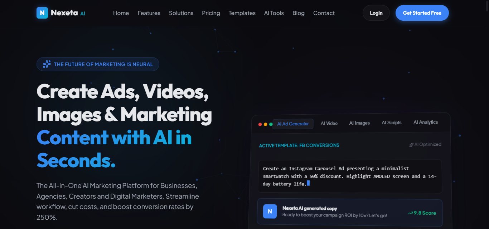
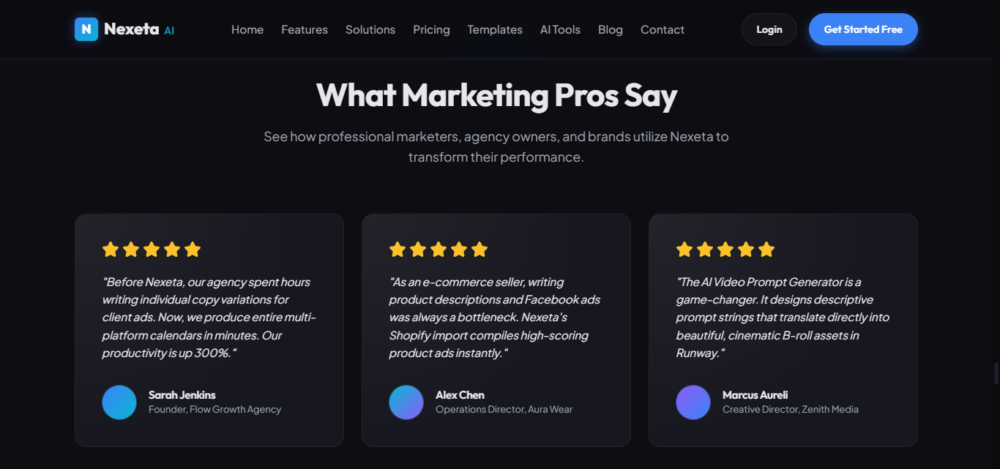
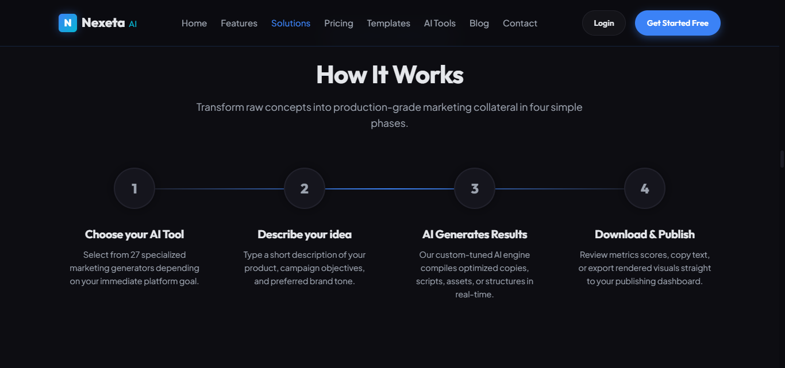
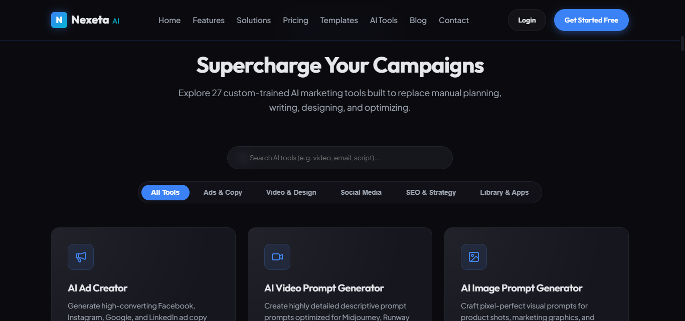

# Nexeta AI Marketing Suite

> AI-powered SaaS marketing platform for businesses, agencies, creators and digital marketers.

Nexeta AI Marketing Suite is a modern marketing platform concept designed to bring AI-assisted content creation, marketing workflows, campaign management and analytics into a unified workspace.

The project includes responsive web interfaces, authentication flows, an interactive marketing dashboard, analytics visualizations and a modular React dashboard component.

This repository demonstrates the frontend architecture, UI/UX design and interactive functionality developed for the Nexeta AI Marketing Suite.

---
## 📸 Project Preview

### Dashboard


### Analytics


### Solutions


### Tools


## 🌐 Live Demo

[**View Nexeta AI Marketing Suite →**]([YOUR-VERCEL-URL](https://nexetaaisuit.vercel.app))

## 🛠️ Tech Stack

- HTML5
- CSS3
- JavaScript
- React
- Tailwind CSS
- Responsive Web Design
- SVG Data Visualization
- GitHub
- Vercel
- ## 🚀 Key Features

- Responsive AI marketing dashboard
- Authentication UI
- Login and signup flows
- Password reset flow
- Email verification interface
- AI Assistant interface
- Marketing campaign workspace
- Analytics dashboard
- Interactive data visualization
- Responsive sidebar navigation
- Dark/Light theme support
- React dashboard component
## 📁 Repository Structure

*   **Static Pages (No Framework Required)**:
    *   [`index.html`](index.html): The platform landing page, featuring neon aesthetics, spotlight glows, grids, and premium navigations.
    *   [`login.html`](login.html), [`login.css`](login.css), [`login.js`](login.js): Dark futuristic login experience with interactive background canvas particles and error validations.
    *   [`signup.html`](signup.html), [`signup.css`](signup.css), [`signup.js`](signup.js): Responsive two-column sign-up form with input validations, error shaking, and trust indicators.
    *   [`dashboard.html`](dashboard.html), [`dashboard.css`](dashboard.css), [`dashboard.js`](dashboard.js): Interactive vanilla dashboard shell with collapsible sidebar navigation, daily SVGs charts switcher, notifications, profile popovers, and an interactive AI Assistant chatbot.
*   **React + Tailwind CSS Component**:
    *   [`Dashboard.jsx`](Dashboard.jsx): A modular, fully responsive React component version of the dashboard. Features full state management for sidebar toggling, dark/light theme shifts, search query filtering, SVG analytical chart toggles, prompt clipboard copying, and a simulated chat assistant with typing states.

---

## 🚀 Running the Web Application

1.  Simply double-click on [`index.html`](index.html) or run a local static server inside this directory (e.g., Live Server extension in VS Code).
2.  Click **"Sign In"** or **"Get Started"** to navigate to [`login.html`](login.html) and [`signup.html`](signup.html).
3.  Fill in simulated credentials and press Sign In. You will see a premium simulated credentials verification sequence followed by an access transition redirecting you directly to the [`dashboard.html`](dashboard.html).

---

## ⚡ Integrating `Dashboard.jsx` in a React App

To integrate the premium React dashboard (`Dashboard.jsx`) into your existing React project:

### 1. Install Dependencies

The React component leverages standard Lucide icons for premium styling. Make sure you have `lucide-react` installed:

```bash
npm install lucide-react
```

### 2. Copy the Component

Copy [`Dashboard.jsx`](Dashboard.jsx) into your React component library (e.g., `src/components/Dashboard.jsx`).

### 3. Tailwind CSS Configurations

Ensure your Tailwind configuration (`tailwind.config.js`) includes the font families and color palette mappings:

```javascript
/** @type {import('tailwindcss').Config} */
module.exports = {
  content: [
    "./src/**/*.{js,jsx,ts,tsx}",
    "./components/**/*.{js,jsx,ts,tsx}"
  ],
  theme: {
    extend: {
      colors: {
        backgroundPrimary: '#0B0B0F',
        backgroundSecondary: '#15151D',
        glassCard: '#1B1B24',
        primaryBlue: '#3B82F6',
        accentCyan: '#06B6D4',
        premiumPurple: '#8B5CF6',
        borderLight: '#2A2A35',
      },
      fontFamily: {
        sans: ['Outfit', 'sans-serif'],
        heading: ['Plus Jakarta Sans', 'sans-serif'],
      },
    },
  },
  plugins: [],
}
```

### 4. Import & Render in App

In your router or main entry file (e.g., `App.js` or `App.jsx`), render the dashboard component:

```jsx
import React from 'react';
import Dashboard from './components/Dashboard';

function App() {
  return (
    <div className="App">
      <Dashboard />
    </div>
  );
}

export default App;
```

---

## 💡 React Dashboard Features & State Handling

*   **Responsive Drawers**: Sidebar collapses to `76px` on tablet/desktop. On mobile devices (`< 768px`), it hides off-canvas and features a sliding overlay triggered via a header hamburger toggle, complete with backdrop click closure.
*   **Theme Switcher**: Integrates state switches managing dark and light visual configurations smoothly.
*   **Floating AI Chat Assistant**: Handles user messages, simulates 1.2s delay typing indicator dots (`NX` processing prompt), and provides context-aware replies for prompt suggestions.
*   **SVG Charts Selector**: Tabbed selection between CTR line graphs, credits load areas, and user activity charts.
